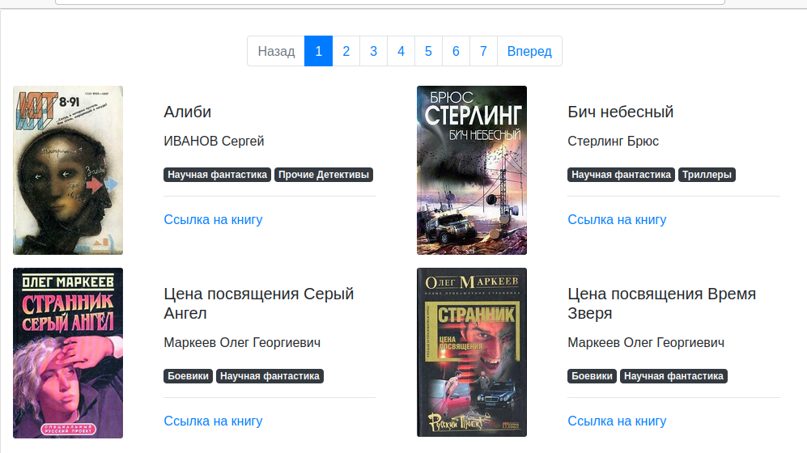

# download_books.py

Это проект для скачивания книг и информации по книгам с сайта [https://tululu.org/](https://tululu.org/). 
Проект содержит два скрипта:
* `download_books.py` - Для скачивания набора произвольных книг с указанием порядкового первого номера и последнего.
* `parse_tululu_category.py` - Для скачивания книг постранично в категории фантастика с указанием первой и последней страницы для скачивания.
* `render_website.py` - Для создания html страниц по шаблону

## Пример одной из страниц сайта


Ссылка на рабочую страницу сайта [books-library](https://maxim-pekov.github.io/books-library). 
## Как он работает:

1. `download_books.py`
   Вы запускаете скрипт командой ниже, параметры <first_id> <last_id> - это id книги с какой по какую вы хотите скачать.
   Если параметры оставить пустыми то скрипт по умолчанию скачает с 1 по 10-ю книгу.

```python
python3 download_books.py <first_id> <last_id>
```
2. `parse_tululu_category.py` Вы запускаете скрипт командой ниже, с указанием необязательных аргументов.
   
```python
python3 parse_tululu_category.py -s <start_page> -l <last_page> -f <dest_folder> -i <save_img>
                                 -t <save_txt> -j <json_path>
```
* --<start_page> - Этот аргумент указывает на первую страницу для скачивания книг, по умолчанию 1
* --<last_page> - Этот аргумент указывает на последнюю страницу которая уже не будет скачена, по умолчанию последняя странница в выбранной категории
* --<dest_folder> - Этот аргумент указывает куда будут скачены книги, по умолчанию это папка 'static'.
* --<save_img> - Этот аргумент принимает yes/no, если указать no, то обложки не будут скачиваться.
* --<save_txt> - Этот аргумент принимает yes/no, если указать no, то книги не будут скачиваться.
* --<json_path> - Этот аргумент принимает название пути к папке куда скачать json файл, если не указать, по умолчанию указывается папка 'static'.

3. `python3 render_website.py` Вы создаете страницы сайта на своем локальном компьютере.
## Установка

Используйте данную инструкцию по установке этого скрипта

1. Установить

```python
git clone https://github.com/Maxim-Pekov/books-library.git
```

2. Создайте виртуальное окружение:

```python
python -m venv venv
```

3. Активируйте виртуальное окружение:
```python
.\venv\Scripts\activate`    # for Windows
```
```python
source ./.venv/bin/activate    # for Linux
```

4. Перейдите в `books-library` директорию.

3. Установите зависимости командой ниже:
```python
pip install -r requirements.txt
```

---

## About me

[https://www.linkedin.com/in/maxim-pekov/](https://www.linkedin.com/in/maxim-pekov/)
</br>

[https://t.me/MaxPekov/](https://t.me/MaxPekov/)
</br>

[//]: # (Карточка профиля: )


[//]: # (Статистика языков в коммитах:)

[//]: # (Статистика языков в репозиториях:)


[//]: # (Статистика профиля:)

[//]: # (Данные по коммитам за сутки:)


[//]: # ([![trophy]&#40;https://github-profile-trophy.vercel.app/?username=Maxim-Pekov&#41;]&#40;https://github.com/ryo-ma/github-profile-trophy&#41;)

